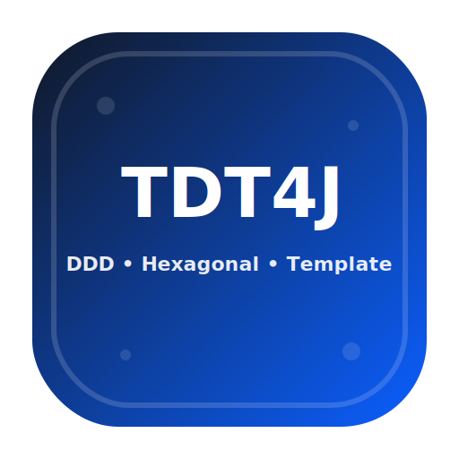

<div align="center">
  

  # TDT4J — TML DDD Template for Java

  一个偏“工程落地”的 DDD + 六边形（Ports & Adapters）Java 项目模板。

  [快速开始](#快速开始) · [项目结构](#项目结构) · [开发指南](#开发指南) · [Star History](#star-history)

  <p>
    <a href="https://github.com/timemachinelab/TML-DDD-Template-Java">
      
    </a>
    <a href="https://github.com/timemachinelab/TML-DDD-Template-Java">
      
    </a>
    <a href="https://github.com/timemachinelab/TML-DDD-Template-Java/issues">
      
    </a>
    
    
  </p>
</div>

---

## 为什么是 TDT4J

- **不是教条 DDD**：模板强调“边界清晰”，让你能先跑起来，再逐步演进。
- **六边形友好**：通过 `port.in / port.out` 把协议、存储、第三方调用都隔离在外圈。
- **便于微服务拆分**：把“一个服务的标准形状”封装进 `tml-standard`，复制即可生长新服务。

如果你想先理解“代码应该放哪”，直接看开发指南的 TL;DR 即可。

---

## 快速开始

### 1) 使用模板创建仓库

- 在 GitHub 点 **Use this template**
- 选择你的组织/个人空间
- 重命名仓库（可选）

### 2) 本地构建

```bash
mvn -DskipTests package
```

---

## 项目结构

这个仓库的根模块：

- `tml-app`：启动/装配（Bootstrap）
- `tml-standard`：一个完整服务（或限界上下文）的实现骨架

`tml-standard` 内部是一套“一个服务的标准形状”：

- `tml-api`：对外服务契约（req/resp、错误码、OpenAPI/Proto）
- `tml-adapter`：适配层（HTTP/RPC/MQ/Job），负责协议接入与数据转换
- `tml-service`：应用层（UseCase），负责用例/流程编排与端口定义（port.in / port.out）
- `tml-domain`：领域层（业务核心），放模型与规则
- `tml-infrastructure`：基础设施实现（DB/缓存/第三方/消息生产者等），实现 port.out
- `tml-client`：对外 SDK（给其它服务或调用方用）

一句话：**越往内越纯业务，越往外越技术/协议**。

---

## 开发指南

- 指南入口：[
  docs/Tml-DDD-Guide.md
  ](docs/Tml-DDD-Guide.md)

这份指南会讲清楚：

- 六边形架构在工程里怎么落
- `api/adapter/service/domain/infrastructure/client` 的职责边界
- req/resp 与服务内 model 如何转换
- 典型“支付订单”链路从外到内怎么走

---

## Star History

最近 Star 趋势可视图：

[](https://star-history.com/#timemachinelab/TML-DDD-Template-Java&Date)

